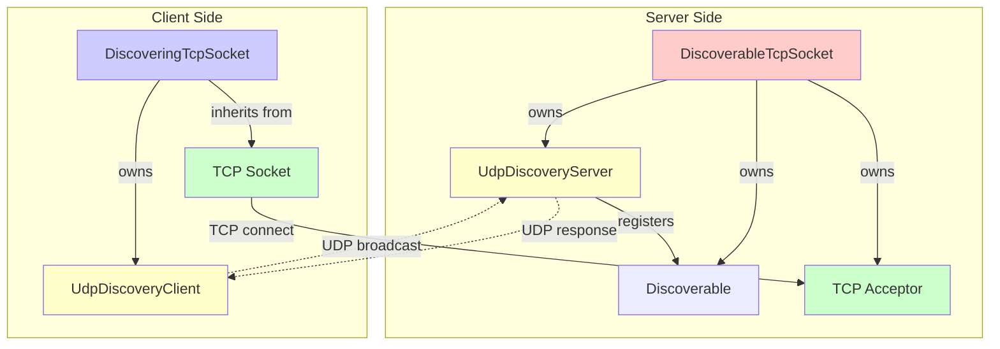
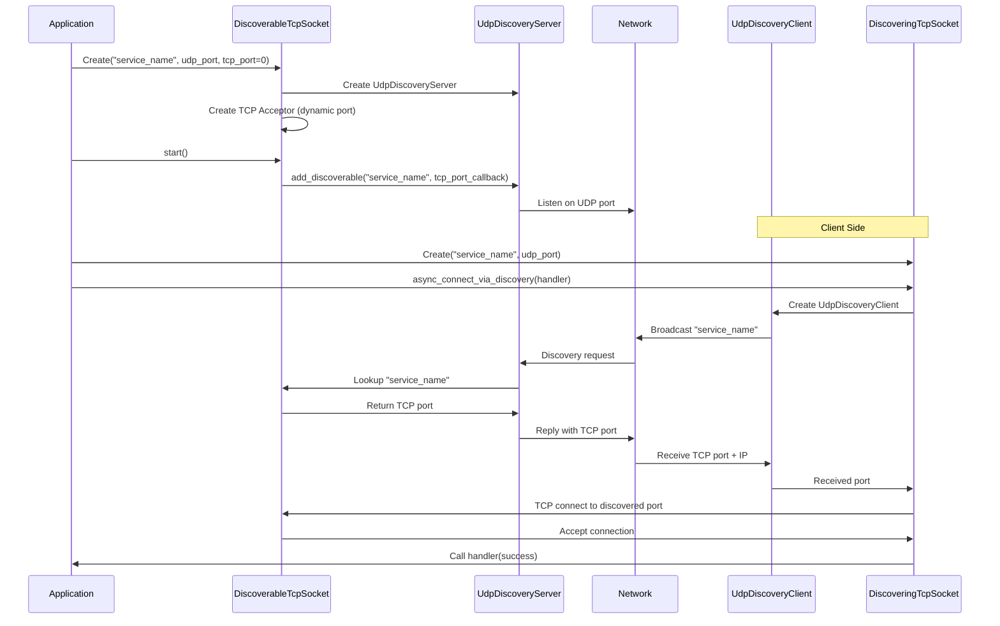
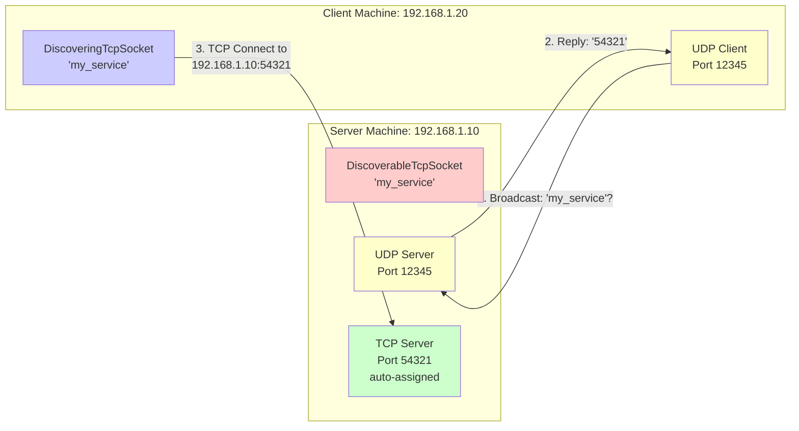

# Discoverable Sockets User Guide

## Overview

The discoverable sockets library provides automatic service discovery for TCP connections. Servers advertise themselves via UDP, and clients automatically discover and connect without needing to know IP addresses or ports in advance.

## Components

**DiscoverableTcpSocket** - Server that advertises itself via UDP  
**DiscoveringTcpSocket** - Client that discovers and connects to servers

## Architecture

### Component Structure



### Discovery Protocol Flow



### Network Communication



## Usage

### Server

```cpp
boost::asio::io_context io_context;

// Create discoverable server (tcp_port=0 for auto-assign)
DiscoverableTcpSocket server(io_context, "my_service", 12345, 0);
server.start();

// Accept connections
boost::asio::ip::tcp::socket socket(io_context);
server.async_accept(socket, [](boost::system::error_code ec) {
    // Handle connection
});

io_context.run();
```

### Client

```cpp
boost::asio::io_context io_context;

// Create discovering client
DiscoveringTcpSocket client(io_context, "my_service", 12345);

// Discover and connect
client.async_connect_via_discovery([](boost::system::error_code ec) {
    if (!ec) {
        // Connected - use client as regular TCP socket
    }
});

io_context.run();
```

## Key Points

- **Service Identifier**: Both server and client must use the same identifier string (case-sensitive)
- **UDP Port**: Both must use the same UDP discovery port (fixed, known in advance)
- **TCP Port**: Server can use `0` for automatic assignment by OS
- **Retry**: Client automatically retries discovery until successful
- **Thread-Safe**: Uses Boost.Asio's io_context for thread safety
