# Serialization Usage Guide

This document shows how to use the EESTV serialization library.

## Basic Usage Flow


## How to Make Your Type Serializable

```mermaid
flowchart TD
    Start[I want to serialize MyType] --> Choice{Choose approach}
    
    Choice -->|Option 1| Member[Member function]
    Choice -->|Option 2| Free[Free function]
    
    Member --> Done[✓ Type is serializable]
    Free --> Done
    
    style Start fill:#e3f2fd
    style Member fill:#c8e6c9
    style Free fill:#c8e6c9
    style Done fill:#a5d6a7
```



### Option 1: Member Function
```cpp
struct MyType {
    int x, y;
    
    template<typename Archive>
    void serialize(Archive& ar) {
        ar & x & y;
    }
};
```

### Option 2: Free Function
```cpp
struct MyType {
    int x, y;
};

template<typename Archive>
void serialize(MyType& obj, Archive& ar) {
    ar & obj.x & obj.y;
}
```

## Complete Example


